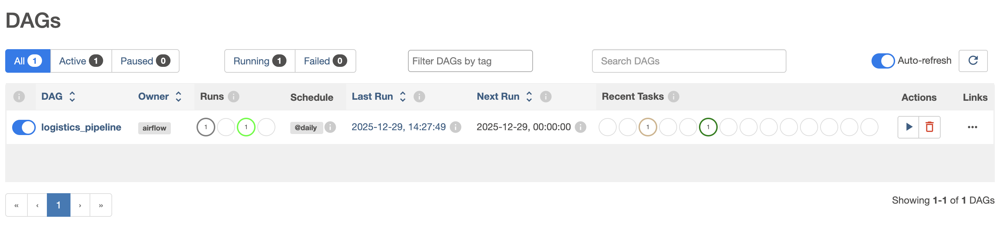

# Logistics Analytics Pipeline

An end-to-end **logistics analytics pipeline** built using **Apache Airflow, dbt, DuckDB, and Apache Superset**.  
This project demonstrates how raw logistics data can be transformed into analytics-ready models and visualized through interactive dashboards using a **modern analytics stack**.

---

## 🧱 Tech Stack

- **Apache Airflow** – Workflow orchestration  
- **dbt** – Data transformation & modeling  
- **DuckDB** – Analytical data warehouse  
- **Apache Superset** – BI & visualization  
- **Parquet** – Columnar storage format  
- **Docker & Docker Compose** – Containerization  

---

## 🏗️ Airflow DAG


*Figure 1: DAG.*

**Flow:** Parquet Files (Raw Data) → Apache Airflow → dbt → DuckDB → Apache Superset → Analytics Dashboards

---

## 📊 Data Models

### `stg_shipments`
Cleans and standardizes raw shipment data:
- `shipment_id`
- `carrier`
- `origin`
- `destination`
- `distance_km`
- `delivery_days`
- `is_delayed`

### `carrier_performance`
Aggregated analytics model:
- `total_shipments`
- `avg_delivery_days`
- `delay_rate_pct`

---

## ⚙️ How the Pipeline Works

1. **Raw logistics data** is stored in Parquet format.
2. **Airflow DAG** orchestrates dbt transformations.
3. **dbt models** create staging and analytics views.
4. **DuckDB** stores transformed data.
5. **Superset** connects to DuckDB for dashboards.

---

## 📸 Dashboard Preview


*Figure 2: Interactive Logistics Dashboard view in Apache Superset.*

## 🚀 How to Run

### 1️⃣ Start Services

Run the containerized environment (Airflow & Superset):

```bash
docker-compose up -d
```

### 2️⃣ Run dbt Transformations

Execute transformations inside the Airflow/dbt container:

```bash
dbt run
```

### 3️⃣ Access Superset

Open your browser and navigate to:

```
http://localhost:8088
```

### 4️⃣ Connect Superset to DuckDB

Use the following SQLAlchemy URI in Superset:

```
duckdb:////app/data/analytics.duckdb
```

---
